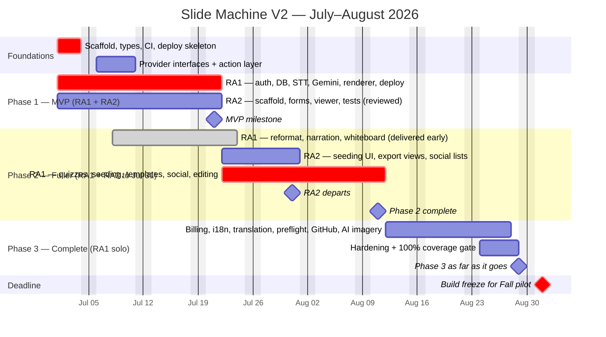

# Slide Machine V2 — Delivery Roadmap & Phasing

Companion to the [SDD](SPEC.md). It plans **how** the spec gets built with the time and people we have. Requirement IDs (e.g., [`GEN-1`](SPEC.md#gen-1-speech-to-slide-generation), [`QUIZ-3`](SPEC.md#quiz-3-publishing--link-return)) refer to the SDD.

## 1. Context & Constraints

- **Deadline:** 2026-09-01, before the Fall 2026 pilot.
- **Time:** ~9 working weeks (July + August 2026).
- **People:**
  - **PI — lead**, all 9 weeks. Sets direction, makes scope/cut-line calls, and **reviews code** (including RA2's), sharing that load with RA1. Not a builder — adds judgment and review, not extra hands.
  - **RA1 — intermediate**, here all 9 weeks (now → Sept 1).
  - **RA2 — entry-level, unproven**, here **July only** (~4 weeks). We don't know if RA2's work is good. Give RA2 small, low-risk tasks that RA1 and the PI can quickly check and redo if needed — never anything requiring real skill, and nothing the pilot depends on unless it's been reviewed.
  - The two RAs code with AI assistance.
- **The binding constraint:** **August has one developer (RA1).** The PI still reviews, but no one else builds. July has two developers, but RA2's output is limited to easy, checkable work that RA1 and the PI have to review. So in July, do the work that's hard for RA1 (integration, architecture) and the safe work RA2 can take (forms, tests, docs) — and keep the skill-heavy build on RA1 the whole time.

## 2. Strategy

1. **Build the foundations first** (provider interfaces, shared types, action layer, deploy/CI) so features slot in later instead of forcing rewrites.
2. **Run two streams in July, split by skill needed, not by frontend/backend.** RA1 owns everything hard on either side, including the parts of the UI that have to look right (slide renderer, layouts, design system). RA2 takes small, self-contained tasks RA1 can check at a glance.
3. **Protect the pilot core.** The pilot needs **speak → slides → exit-ticket quiz**, plus editing, templates, and seeding — not billing, i18n, or AI imagery. Those are the first things to cut if time runs short ([§8](#8-risks--cut-line)). (The social layer is now **scheduled** in Phase 2 — see [§6](#6-phase-2--fuller-version) — because much of it landed early alongside profiles, but it is built opportunistically and **remains a cut candidate**: it's the first Phase-2 work to drop if the pilot core is ever at risk.)
4. **Give solo-August only work that doesn't need a second person.** RA1 reviews and, if needed, rewrites RA2's work **during July** — no unchecked RA2 code goes into August, when there's no time to find out it's wrong.

## 3. Phase Overview

| Phase | Window (approx.) | People | Theme |
| --- | --- | --- | --- |
| **Foundations** | Jul wk 1 (continuous after) | RA1 + RA2 | Scaffold, shared types, provider interfaces, deploy/CI |
| **Phase 1 — MVP** | Jul wk 1–3 | RA1 + RA2 | Core loop: sign in → speak → AI slides → save/view |
| **Phase 2 — Fuller** | Jul wk 4 → Aug wk 2 | RA2 (to Jul 31) + RA1 | Quizzes, seeding, templates, deeper editing, social, reformat/narration/whiteboard |
| **Phase 3 — Complete** | Aug wk 3–4 (+buffer) | RA1 (PI reviews) | Billing, i18n/translation, preflight, GitHub, AI imagery, hardening |

The PI reviews across every phase; the People column shows who builds.

"Complete" = everything in the SDD **except** items already marked Future Work (SDD §18).

### Current status (2026-07-23)

Build-progress snapshot; the scope lists in [§5](#5-phase-1--mvp)–[§7](#7-phase-3--complete-all-non-future) define each item.

**Phase 1 — MVP — ✅ complete.** Core loop shipped on DO (sign in → speak → AI slides → save/view).

**Phase 2 — Fuller — 🟡 in progress.**

- ✅ Done: `QUIZ-1..6`; `SEED-1/2/3` + `EXP-4` (Google); `GEN-7`/`IMG-3`; `GEN-8`; `CAP-4`; `EDIT-2/3` + `TMPL-5`; `AUTH-5`; `SOC-4` (profiles); `TECH-4` (server config); `TECH-9` (billing-provider abstraction); `ADMIN-1`/`2`/`4`/`5`/`7` (allowlist, console, moderation, entity-settings edits, audit log). Delivered early from Phase 3: `GEN-4` (reformat/diarization/narration refine), `PLAY-2` (TTS narration), `EDIT-4`/`5` + `EDIT-6` + `TMPL-7` + `GEN-10` (whiteboard annotation, tools, spoken-transcript editing, layout, generation pause/resume).
- ⬜ Outstanding: `TMPL-1/4` (library + custom editor); `EXP-1/2/3` (export/import); `AUTH-3/4` (email verify + password reset); `SOC-1/2/3` (voting, browse/search/sort, feeds); `GEN-9` (animated layout transitions); `P-10` (soft delete for all entity data); `ADMIN-3/6` (private-lecture-view logging, soft-deleted-content viewing); `IMG-5` (image attribution display).

**Phase 3 — Complete — ⬜ not started** (its early-delivered items are in Phase 2 above).

- ⬜ Outstanding: `BILL-1..6` + Stripe + metering; `PREP-1/2/3/4` (preflight + verbal); GitHub sign-in + connect; `TECH-12` (i18n) + `SHARE-2` (translation); `IMG-4` (AI imagery); `P-11` (retention purge sweep); `P-1..P-9` hardening, reduced-motion a11y, 100% coverage gate.

Admin/operations (`ADMIN-1..7`, [SPEC §20](SPEC.md#20-administration-operations--moderation)) is **Phase 2** work — its done/outstanding items are folded into the Phase 2 snapshot above; operator detail is in [ADMINISTRATION.md](ADMINISTRATION.md).

## 4. Foundations (start week 1, grow throughout)

Not a phase — built first, then extended continuously:

- **Stack scaffold** — React+Vite+Tailwind, Express, MongoDB, monorepo with the **shared TypeScript types** module ([`TECH-1`](SPEC.md#tech-1-front-end)/[`2`](SPEC.md#tech-2-back-end)/[`3`](SPEC.md#tech-3-database)/[`5`](SPEC.md#tech-5-client-configuration)/[`6`](SPEC.md#tech-6-shared-types--data-models)). Shared types are the contract that lets the two streams run in parallel.
- **Provider interfaces** ([`TECH-8`](SPEC.md#tech-8-ai-provider-abstraction-layer)) — define `TranscriptionProvider`, `GenerationProvider`, `ImageGenerationProvider`, `QuizGenerationProvider` up front, even with one adapter each. Cheap now, expensive to add later.
- **Action/command layer** ([`TECH-13`](SPEC.md#tech-13-application-actioncommand-layer)) — route all deck/project changes through it from the start, so UI, voice, and future agents share one path.
- **Deploy + CI/CD** ([`TECH-10`](SPEC.md#tech-10-deployment-topology-digital-ocean-app-platform)/[`11`](SPEC.md#tech-11-local-dev--cicd)) — DO App Platform + `docker compose` + GitHub Actions by day ~2, so integration is continuous instead of one big merge at the end.
- **Testing** ([`TECH-7`](SPEC.md#tech-7-testing--coverage)) — write tests alongside features. Enforce the **100% gate in Phase 3** (with documented exclusions, SDD Open Q #9); enforcing it from day 1 would slow the MVP.

## 5. Phase 1 — MVP

**Goal:** one instructor can sign in, create a project (with optional typed seed notes), speak, watch coherent AI slides appear with sensible layouts and images, control playback, and save + view the deck — deployed on DO.

**In scope (SDD IDs):** [`AUTH-1`](SPEC.md#auth-1-registration--sign-in-methods) (email+password + Google sign-in), [`AUTH-2`](SPEC.md#auth-2-login--sessions); [`PROJ-1`](SPEC.md#proj-1-pre-create-a-project)/[`2`](SPEC.md#proj-2-project-lifecycle) (text seed only); [`CAP-1`](SPEC.md#cap-1-session-lifecycle)/[`2`](SPEC.md#cap-2-microphone--permissions)/[`3`](SPEC.md#cap-3-speech-to-text-transcription) (Google Cloud STT); [`GEN-1`](SPEC.md#gen-1-speech-to-slide-generation)/[`2`](SPEC.md#gen-2-ai-provider-abstraction)/[`3`](SPEC.md#gen-3-live-display)/[`5`](SPEC.md#gen-5-progressive-slide-rendering-skeleton-loaders)/[`6`](SPEC.md#gen-6-ai-layout-selection); [`TMPL-2`](SPEC.md#tmpl-2-conventional-layout-types)/[`3`](SPEC.md#tmpl-3-pre-made-templates)/[`6`](SPEC.md#tmpl-6-layout-descriptors-for-ai-selection) (2–3 built-in templates with minimal layout descriptors); [`IMG-1`](SPEC.md#img-1-real-time-image-enrichment)/[`2`](SPEC.md#img-2-fault-tolerance) (seeded + one search source); [`PLAY-1`](SPEC.md#play-1-playback-controls); [`SHARE-1`](SPEC.md#share-1-saved-deck-viewer--permalink) (private save + viewer + permalink); [`EDIT-1`](SPEC.md#edit-1-full-content-editing) (basic). Plus the §4 foundations.

**Deferred from MVP:** quizzes, file/Drive/GitHub seeding, preflight, template editor, billing, social, i18n, translation, voice commands, disambiguation, AI image generation, animated transitions, reformat.

### 5.1 MVP Labor Division

Two streams joined by the **shared types**, split by how much skill the work needs. RA1 owns the types, the hard integration, **and the UI that has to look right**. RA2 works against the same types on small, checkable UI and support tasks, mocking the API until it's live — RA1 reviews all of it before it lands.

| Stream | Owner | Work |
| --- | --- | --- |
| **A — Backend + integration + the skill-heavy UI** | **RA1** | Monorepo + shared types + provider interfaces ([`TECH-6`](SPEC.md#tech-6-shared-types--data-models)/[`8`](SPEC.md#tech-8-ai-provider-abstraction-layer)); Express API; **auth** ([`AUTH-1`](SPEC.md#auth-1-registration--sign-in-methods) email+Google, [`AUTH-2`](SPEC.md#auth-2-login--sessions), JWT); MongoDB models (User/Project/Deck/Slide); **Google Cloud STT** streaming ([`CAP-3`](SPEC.md#cap-3-speech-to-text-transcription)); **Gemini** generation adapter + **layout selection** ([`GEN-1`](SPEC.md#gen-1-speech-to-slide-generation)/[`2`](SPEC.md#gen-2-ai-provider-abstraction)/[`6`](SPEC.md#gen-6-ai-layout-selection)); **image enrichment** ([`IMG-1`](SPEC.md#img-1-real-time-image-enrichment)/[`2`](SPEC.md#img-2-fault-tolerance)); action-layer seed ([`TECH-13`](SPEC.md#tech-13-application-actioncommand-layer)); **DO deploy + CI** ([`TECH-10`](SPEC.md#tech-10-deployment-topology-digital-ocean-app-platform)/[`11`](SPEC.md#tech-11-local-dev--cicd)); **design system** (tokens/primitives, [`TECH-1`](SPEC.md#tech-1-front-end)/[`5`](SPEC.md#tech-5-client-configuration)); the **live slide renderer** + skeleton loaders ([`GEN-3`](SPEC.md#gen-3-live-display)/[`5`](SPEC.md#gen-5-progressive-slide-rendering-skeleton-loaders)); **template/layout rendering** ([`TMPL-2`](SPEC.md#tmpl-2-conventional-layout-types)/[`3`](SPEC.md#tmpl-3-pre-made-templates)). The last three are the product's visible output, so they stay on RA1. |
| **B — Small UI & support work (reviewed)** | **RA2** | App scaffold on RA1's design system; **auth screens**; project-create + text-seed **forms** ([`PROJ-1`](SPEC.md#proj-1-pre-create-a-project)); **playback controls** UI ([`PLAY-1`](SPEC.md#play-1-playback-controls)); **deck viewer + permalink** page ([`SHARE-1`](SPEC.md#share-1-saved-deck-viewer--permalink)); basic **deck editor** shell ([`EDIT-1`](SPEC.md#edit-1-full-content-editing)); **fixtures**, component **tests**, component **docs**. Each task scoped so a wrong result is easy to spot and easy to replace. |

**Why:** since we don't know if RA2's work is good, nothing skill-heavy or pilot-critical can rely on him. The renderer and layouts *are* the product's output — a subtly wrong renderer is the most damaging thing to get wrong in the MVP, so it goes to RA1. RA2 keeps small, easy-to-check forms/tests/docs where AI helps most and a mistake is obvious and local. **This puts more on RA1 and means July's two people aren't really 2× the output — an accepted cost, tracked in [§8](#8-risks--cut-line).**

**Keeping both moving:**

- Agree the **shared types + a few fixtures** (a sample slide, a sample deck) on **day 1–2**. RA1 builds the renderer against them; RA2 builds forms/viewer/editor shell against the same fixtures. Swapping mocks for the real API is a small, late step for both.
- Define the **generation event shape** (how streamed slide updates reach the client) early — it's where Stream A's pipeline meets the renderer, and Stream B's surrounding UI reads it too.
- **RA1 and the PI review every RA2 change as it merges**, not at month-end; RA1 rewrites anything below bar right away — paid in July while there's slack, never in solo-August.

**Cadence (July wk 1–3):**

- **Week 1** — RA1: scaffold + shared types + auth + DB + deploy skeleton + STT spike + design system + static renderer against fixtures. RA2: app scaffold + auth screens + fixtures.
- **Week 2** — RA1: Gemini generation + layout selection + image enrichment behind the API; STT streaming; live renderer on generation events (mock→real); template rendering. RA2: playback UI, project/seed forms, deck viewer + permalink, editor shell — all against fixtures, reviewed on merge.
- **Week 3** — End-to-end (real STT → Gemini → render), deck save/view/edit, polish, deploy, demo. Both pair on integration and bugs; RA1 finishes any RA2 rework before month-end.

**Exit criteria:** the core loop runs on DO for one user; CI green; **every RA2 change reviewed, accepted or rewritten by RA1, and owned by RA1 going into August.**

## 6. Phase 2 — Fuller Version

**Goal:** the full pilot experience — quizzes, richer seeding, templates, deeper editing, and the social layer — plus the reformat/narration/whiteboard work that was delivered ahead of its original Phase 3 slot. Much of it overlaps RA2's last July week; give RA2 UI forms (seeding UI, export views, social lists) before RA1 continues alone.

**In scope:** [`QUIZ-1`](SPEC.md#quiz-1-quiz-yaml-generation-in-the-monolith)..[`6`](SPEC.md#quiz-6-loose-coupling) (generate quiz definition + publish via the **imported Quiz Generator library** + publish config + delegated Google access — **needs [`EXP-4`](SPEC.md#exp-4-connected-accounts-google-drive--github) Google connect first**; domain-restricted responses deferred); [`SEED-1`](SPEC.md#seed-1-document-seeding)/[`2`](SPEC.md#seed-2-image-seeding)/[`3`](SPEC.md#seed-3-seed-management) + [`EXP-4`](SPEC.md#exp-4-connected-accounts-google-drive--github) (Google Drive/Docs/Slides + uploads + seed images); [`TMPL-1`](SPEC.md#tmpl-1-template-library--preview)/[`4`](SPEC.md#tmpl-4-custom-templates-create--edit--save)/[`5`](SPEC.md#tmpl-5-template-application) (library + custom template editor); [`GEN-7`](SPEC.md#gen-7-ai-image-guidance), [`IMG-3`](SPEC.md#img-3-image-disambiguation) (image guidance + disambiguation); [`GEN-8`](SPEC.md#gen-8-new-slide-vs-update-current) (new-vs-update + manual mode); [`GEN-9`](SPEC.md#gen-9-animated-layout-transitions) (animated transitions); [`EDIT-2`](SPEC.md#edit-2-deck-level-template-switch)/[`3`](SPEC.md#edit-3-per-slide-layout-switch); [`EDIT-6`](SPEC.md#edit-6-spoken-transcript-editing) (spoken-transcript editing); [`EXP-1`](SPEC.md#exp-1-deck-export)/[`2`](SPEC.md#exp-2-standards-based-data-export)/[`3`](SPEC.md#exp-3-round-trip-import) (export/import); [`CAP-4`](SPEC.md#cap-4-voice-commands) (voice commands); [`AUTH-3`](SPEC.md#auth-3-email-verification)/[`4`](SPEC.md#auth-4-password-reset)/[`5`](SPEC.md#auth-5-profile--ownership); [`SOC-1`](SPEC.md#soc-1-voting)..[`4`](SPEC.md#soc-4-user-profiles) (voting, browse/search/sort, feeds, profiles); [`P-10`](SPEC.md#16-privacy-security--compliance) (**soft delete** for all entity data — deletes tombstone rather than remove, recoverable within the retention window); [`ADMIN-1`](SPEC.md#20-administration-operations--moderation)..[`7`](SPEC.md#admin-7-audit-log) (administration, operations & moderation — console, moderation, audit log); [`IMG-5`](SPEC.md#img-5-image-attribution--licensing-display) (image attribution & licensing display); [`TECH-4`](SPEC.md#tech-4-server-configuration) (server configuration) and [`TECH-9`](SPEC.md#tech-9-billing-provider-abstraction-layer) (billing-provider abstraction layer). **Delivered early** (built ahead of the original Phase 3 plan): [`GEN-4`](SPEC.md#gen-4-post-lecture-ai-reformat-holistic-regeneration) (post-lecture reformat + **speaker diarization** + **narration refine**), [`PLAY-2`](SPEC.md#play-2-narration-playback) (TTS **narration playback** + retained-audio playback), [`EDIT-4`](SPEC.md#edit-4-whiteboard-annotation)/[`EDIT-5`](SPEC.md#edit-5-whiteboard-tools) (**whiteboard annotation + tools** with narration-synced replay) the [`TMPL-7`](SPEC.md#tmpl-7-whiteboard-layout) **whiteboard slide layout**, and [`GEN-10`](SPEC.md#gen-10-whiteboard-generation-pause--resume) (**whiteboard generation pause/resume**). Action layer fully built out; coverage rising.

## 7. Phase 3 — Complete (all non-future)

**Goal:** finish the rest of the SDD and harden. **RA1 solo, August** — the phase most at risk of not fitting.

**In scope:** [`BILL-1`](SPEC.md#bill-1-subscription-tiers)..[`6`](SPEC.md#bill-6-configurable-pricing--caps) + Stripe + metering/enforcement ([`P-8`](SPEC.md#16-privacy-security--compliance)); [`PREP-1`](SPEC.md#prep-1-preflight-concept-extraction)/[`2`](SPEC.md#prep-2-instructor-review--honing)/[`3`](SPEC.md#prep-3-use-of-the-honed-concept-set) (preflight extraction + honing UI) and [`PREP-4`](SPEC.md#prep-4-verbal-interaction-with-the-preflight) (verbal preflight); **GitHub sign-in** ([`AUTH-1`](SPEC.md#auth-1-registration--sign-in-methods)) and **GitHub connect** ([`EXP-4`](SPEC.md#exp-4-connected-accounts-google-drive--github)); [`TECH-12`](SPEC.md#tech-12-internationalization-i18n--localization) (i18n) + [`SHARE-2`](SPEC.md#share-2-post-lecture-translated-viewing) (translation); [`IMG-4`](SPEC.md#img-4-ai-generated-imagery-optional) (AI imagery); [`P-11`](SPEC.md#16-privacy-security--compliance) (**retention purge sweep** — daily job hard-deletes soft-deleted records older than `DELETED_DATA_RETENTION_DAYS`, default 90); full [`P-1..P-9`](SPEC.md#16-privacy-security--compliance) hardening, accessibility (reduced-motion), **100% coverage gate enforced**, and docs.

## 8. Risks & Cut-Line

- **August is one developer on the biggest, most integration-heavy slice** (Stripe, i18n, translation, preflight) plus the 100% coverage gate. The PI reviews but doesn't build, so this doesn't add capacity. **Phase 3 probably won't fully land.** Plan for it.
- **RA2's unknown quality shifts load onto RA1.** Moving the renderer, layouts, and design system to RA1 (§5.1) means July's two developers don't produce 2×. The PI shares the review burden, but the rewrites still fall on RA1 — which is the main reason Phase 3 is at risk.
- **RA2's work must be reviewed in July and owned by RA1.** RA1 and the PI review as it merges; if it isn't, RA1 loses August time fixing code no one checked. Make this an MVP exit criterion (§5.1).
- **100% coverage across this surface in 9 weeks is a big cost on its own.** Enforce the gate only from Phase 3, with documented exclusions (SDD Open Q #9), or it drags every earlier phase.
- **Cut order** if time runs short (cut from the top — none are needed for the pilot): [`IMG-4`](SPEC.md#img-4-ai-generated-imagery-optional) (AI imagery) → [`SHARE-2`](SPEC.md#share-2-post-lecture-translated-viewing) + non-English i18n → [`PREP-4`](SPEC.md#prep-4-verbal-interaction-with-the-preflight) (voice preflight), then preflight depth [`PREP-1`](SPEC.md#prep-1-preflight-concept-extraction)/[`2`](SPEC.md#prep-2-instructor-review--honing)/[`3`](SPEC.md#prep-3-use-of-the-honed-concept-set) (optional, non-blocking) → GitHub sign-in/connect → [`SOC-3`](SPEC.md#soc-3-feeds)/[`4`](SPEC.md#soc-4-user-profiles) depth (keep [`SOC-1`](SPEC.md#soc-1-voting) voting) — scheduled in Phase 2 but still first among Phase-2 work to drop → reduce billing to simple tier-gating (defer full Stripe self-serve [`BILL-2`](SPEC.md#bill-2-billing-provider-stripe-integration)/[`5`](SPEC.md#bill-5-plan-management)).
- **Protect Phases 1–2.** They are the pilot. If the schedule slips, it slips into Phase 3 product features — never the core loop or quizzes.

## 9. Milestones

| Date (approx.) | Milestone |
| --- | --- |
| ~Jul 3 | Foundations up: scaffold, shared types, CI, deployed skeleton |
| ~Jul 21 | **Phase 1 (MVP) complete** — core loop demoable on DO |
| ~Jul 31 | RA2 departs; Phase 2 underway (quizzes + seeding + templates) |
| ~Aug 11 | **Phase 2 complete** — full pilot experience |
| ~Aug 29 | **Phase 3 as far as it goes**; hardening + coverage |
| **Sep 1** | **Deadline** — build freeze for the Fall pilot |

## 10. Timeline (Gantt)

Renders in GitHub and any Mermaid-aware Markdown viewer. Dates approximate; `crit` marks the pilot-critical path.

The PI reviews across all phases (including RA1's solo-August work), so no separate bar is shown for review.
